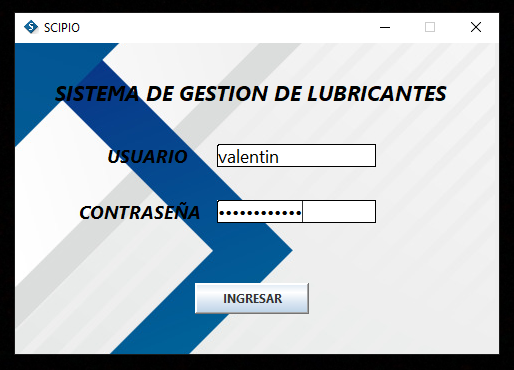
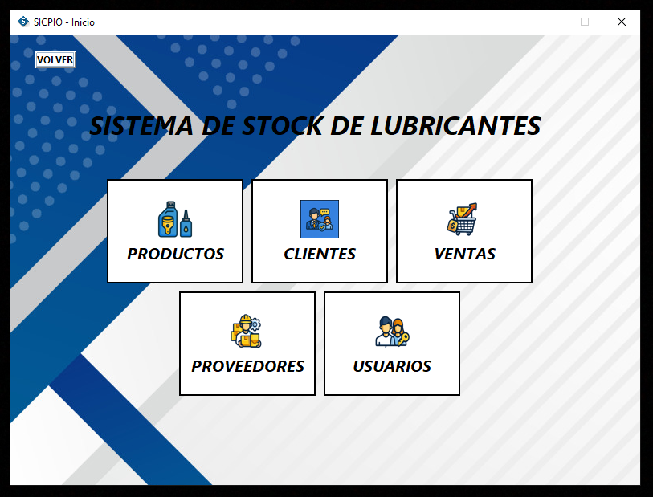
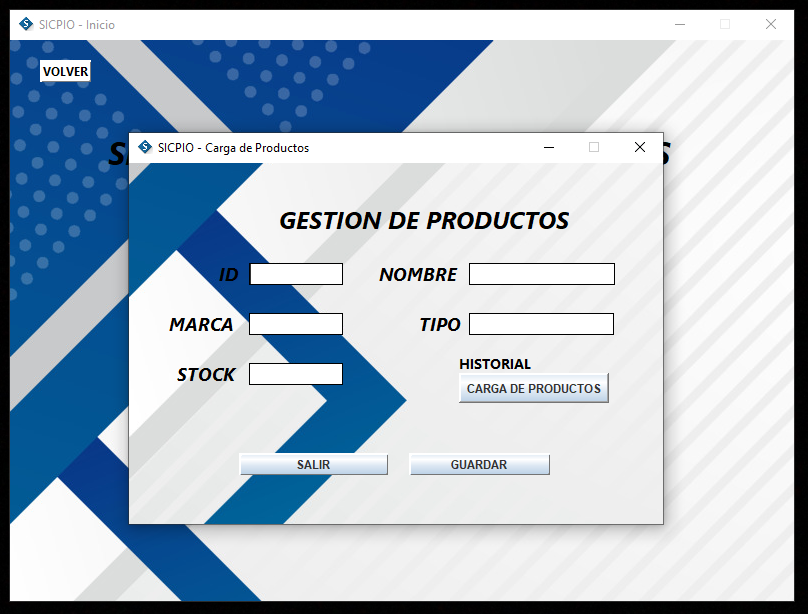
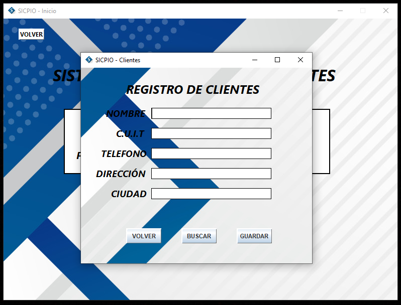
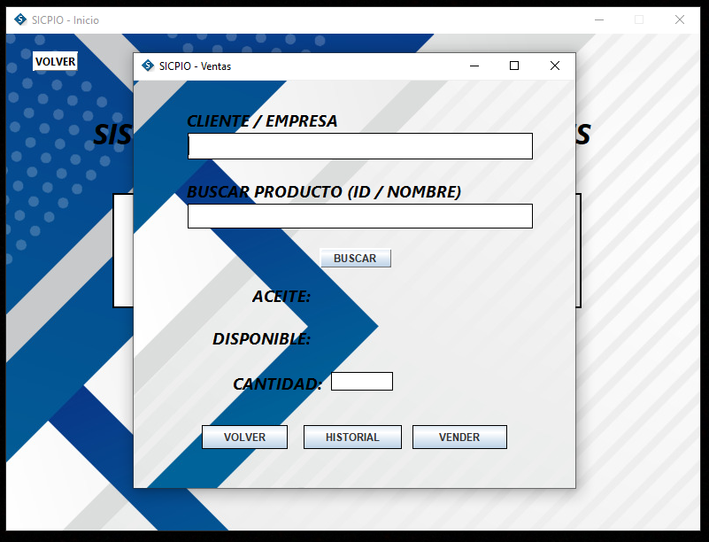
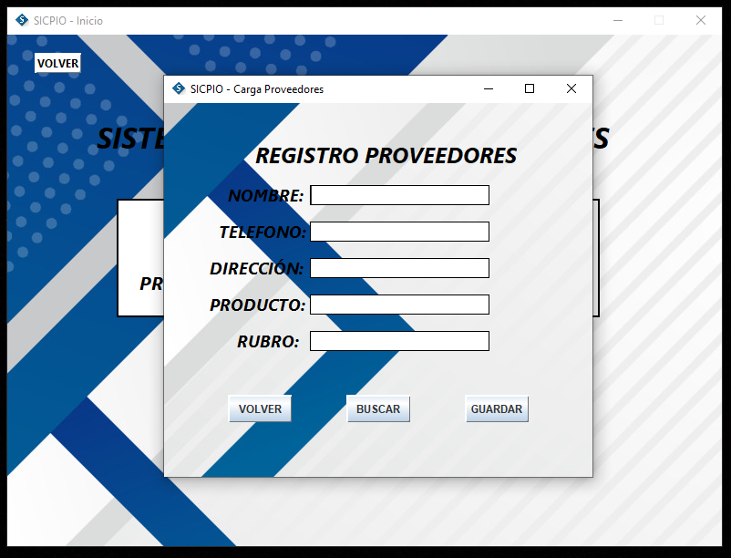
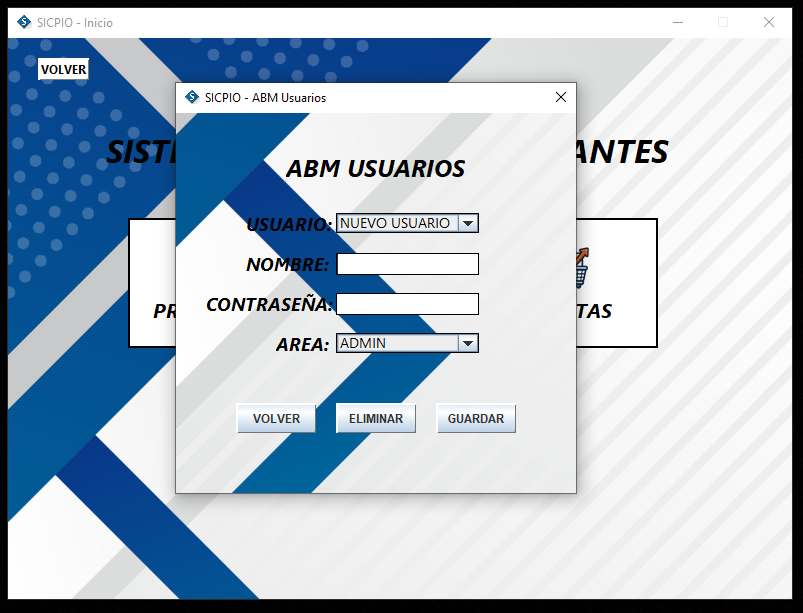

#SCIPIO - Sistema de Gestión de Stock de Lubricantes

## 📌 Descripción
**Scipio** es una apliación desarrollada en Java diseñada para optimizar la administración de un lubricentro. El mismo permite gestionar el inventario de productos, registrar proveedores y agilizar el proceso de ventas.

## 🚀 Características Principales
* **Gestión de Productos:** Registro, edición y control de stock (ID, NOMBRE, MARCA, TIPO, CANTIDAD).
* **Módulo de Proveedores:** Administración completa de datos de contacto y rubros.
* **Sistema de Ventas:** Búsqueda rápida de clientes por CUIT y validación de existencia en tiempo real.
* **Historial Dinámico:** Visualización de registros mediante ventanas emergentes (`JDialog`) y tablas organizadas.

## 🛠️ Tecnologías Utilizadas
* **Lenguaje:** Java 8+
* **Interfaz Gráfica:** Swing y AWT (NetBeans GUI Builder).
* **Gestión de Versiones:** Git y GitHub.

## 📦 Instalación y Uso
1. Clonar el repositorio: `git clone https://github.com/valentinb18/Scipio.git`
2. Abrir el proyecto en **NetBeans IDE**.
3. Ejecutar la clase `Login.java` para iniciar la aplicación.

## 📸 Capturas de Pantalla

---------------------------------------------------------------------------------------------------------------------------------------------------------------------
Desarrollado por [valentinb18](https://github.com/valentinb18) para examen final de la materia Programacion II de la Tecnicatura Universitaria en Programacion (TUP).
